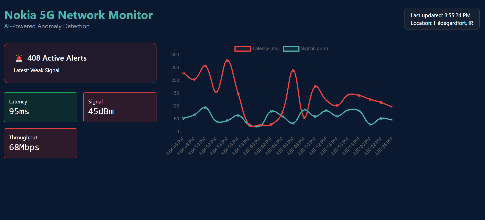

# AI-Powered 5G Network Anomaly Detective
A React/Redux dashboard simulating Nokia-grade 5G network monitoring. Recently Nokia had been trying to test their 5G networks in different remote areas So I decided to create a Dashboard in which if your local machine is connected to  WiFi or any other network connection then this react web app will track the Latency, Signal Strength and Throughput of the network every 2 seconds and will raise Active alerts if latency gets higher then 100ms currently it uses mock data from Faker but can be used for live network strength tracking by connecting it to real API of Nokia. 




## **Why This Project?**  
Built to mirror **real Nokia internal tools**, this dashboard:  
- Simulates live 5G KPIs (latency, throughput, signal strength) using mock data.  
- Detects anomalies (e.g., latency >100ms) in real-time.  
- Currently uses Faker to generate mock data but can be linked to *OpenAI ChatGPT-4o* to suggest the solution *as if a Nokia engineer wrote them*.  
- Designed to **stand out in Nokia’s UI Web Developer intern hiring process** by demonstrating:  
  - **5G domain awareness** (terminology, common issues).  
  - **Clean, responsive UI** (TailwindCSS, dark theme).  
  - **Redux-powered state management** for scalable data flow.  


## **Tech Stack**  
| Category       | Tech Used |  
|----------------|-----------|  
| Frontend       | React, Redux, Chart.js |  
| Styling        | TailwindCSS (Nokia-like dark theme) |  
| Data Simulation| Faker.js for realistic 5G logs |  
| AI Integration | OpenAI GPT-4 API |  
| Live Updates   | 2-second auto-refresh with dynamic graphs |  


## **Key Features** 
- Randomized but realistic metrics (latency, signal drops, throughput).  
- Historical data visualized with **Chart.js**.  
- Redux-triggered alerts when thresholds are breached.  


## 🛠 **How to Run This Project**  
1. **Clone the repo**  
   ```bash  
   git clone [your-repo-url]  
   cd nokia-5g-ai

2. **Install dependencies**  
    npm install

3. **Run Project**
    npm run prestart
    npm start
